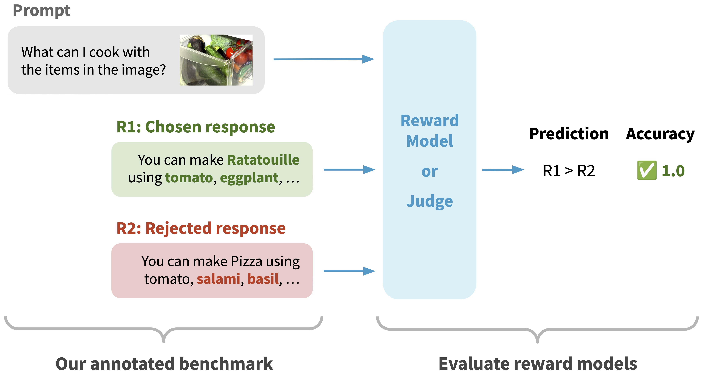

# Multimodal RewardBench
Multimodal RewardBench is a holistic benchmark for evaluating reward models for vision-language models (VLMs), covering six key areas: general correctness, preference, knowledge, reasoning, safety, and visual question-answering (VQA). 
It provides 5,000 annotated triplets of (multimodal prompt, chosen response, rejected response).

Paper: [Multimodal RewardBench: Holistic Evaluation of Reward Models for Vision Language Models](https://arxiv.org/abs/2502.14191)


<p align="center">
  
</p>


## Leaderboard
| Model                                 | Overall | General Correctness | General Preference | Knowledge | Reasoning | Safety | VQA  |
|---------------------------------------|---------|----------------------|--------------------|-----------|-----------|--------|------|
| Claude 3.5 Sonnet (Dec 2024)                   | 0.720   | 0.626                | 0.678              | 0.739     | 0.668     | 0.687  | 0.856|
| Gemini 1.5 Pro (Dec 2024)                     | 0.720   | 0.635                | 0.677              | 0.663     | 0.618     | 0.765  | 0.872|
| GPT-4o (Dec 2024)                                | 0.715   | 0.626                | 0.690              | 0.720     | 0.647     | 0.669  | 0.872|
| Llama-3.2-90B-Vision-Instruct        | 0.624   | 0.600                | 0.684              | 0.612     | 0.546     | 0.519  | 0.771|
| Aria                                  | 0.573   | 0.595                | 0.635              | 0.555     | 0.524     | 0.502  | 0.642|
| Molmo-7B-D-0924                      | 0.543   | 0.568                | 0.594              | 0.546     | 0.521     | 0.442  | 0.603|
| Llama-3.2-11B-Vision-Instruct        | 0.524   | 0.578                | 0.658              | 0.555     | 0.512     | 0.355  | 0.558|
| Llava-1.5-13B                        | 0.489   | 0.533                | 0.552              | 0.505     | 0.513     | 0.349  | 0.518|


**Submit to leaderboard**:
If you'd like to submit your work to the leaderboard, please create a pull request with the following information:
  
- Code to run your model on the benchmark. You should provide a script similar to `scripts/1_run_model_as_judge_gpt4o.py`, which loads the model, runs inference, and saves predictions in JSONL format from start to finish.

- Your prediction file in JSONL format (see `outputs/example.jsonl` for a toy example), where each line corresponds to each example of the original data, and is a dictionary like below. This will allow our accuracy calculation script (`scripts/2_get_accuracy.py`) to function correctly.
```
{
  "Label": <A or B, as provided in data/all_data.json>, 
  "output": <judge or reward model prediction, concluding with [[A]] or [[B]]>,
  "ID": <ID, as provided in data/all_data.json>,
  "Meta": {"Category": <Category, as provided in data/all_data.json>},
}
```


## 0. Set up environment
```
conda create -n mmrewardbench python=3.10
conda activate mmrewardbench
pip install datasets==3.1.0 openai
```

## 1. Download the dataset
After you clone this repo, run the following script to download the original
images/data for the underlying 3rd party datasets.
```
python scripts/0_download_data.py
```

After downloading, your repo will look like:
```
- data/
    - images/
        - EMMA-Coding/
        - image2struct/
        - mathvista/
        - MMBench/
        - mmmu-s/
        - mmmu-v/
        ...
    - all_data.json
```

`data/all_data.json` is the main file containing Multumodal RewardBench. Each
example consists of:
 - 'Text' (prompt)
 - 'Image' (pointer to image)
 - 'Output1' (response candidate 1)
 - 'Output2' (response candidate 2)
 - 'Better' (label: which of the response candidates is better)


## 2. Evaluate models
First, run a reward model or VLM-as-a-judge on the benchmark. Here is an
example script if you run GPT-4o as judge:
```
python scripts/1_run_model_as_judge_gpt4o.py --answers-file outputs/gpt4o.jsonl
```

Then, calculate the accuracy of the judge:
```
python scripts/2_get_accuracy.py --answers-file <your output file from previous command, e.g. outputs/example.jsonl>
```


## Acknowledgments
Our dataset contains pointers to the following open datasets. We do not
distribute their image data; we instead provide a script to download and process
their
data on your own as described in the above section.

    - No-Caps (License: CC-by 2.0) https://nocaps.org/
    - Llava Bench (License: Apache-2.0) https://github.com/haotian-liu/LLaVA/blob/main/docs/LLaVA_Bench.md
    - VisIT Bench (License: cc-by-4.0) https://visit-bench.github.io/
    - MMBench (License: Apache-2.0) https://github.com/open-compass/MMBench
    - SEED-Bench (License: CC-By-NC 4.0) https://arxiv.org/pdf/2307.16125 
    - MMMU-Pro (License: apache-2.0) https://huggingface.co/datasets/MMMU/MMMU_Pro
    - Math-vista (License: cc-by-sa-4.0) https://huggingface.co/datasets/AI4Math/MathVista
    - Image2struct (License: apache-2.0) https://crfm.stanford.edu/helm/image2struct
    - EMMA (License: cc-by-sa-4.0) https://emma-benchmark.github.io/
    - RealWorldQA (License: cc-by-nd-4.0) https://huggingface.co/datasets/xai-org/RealworldQA
    - PAIRS (License: cc-by-4.0) https://github.com/katiefraser/PAIRS/blob/main/Data%20Sheet.md

Note: Our paper also used [Hateful Memes](https://huggingface.co/datasets/neuralcatcher/hateful_memes); however,
due to the no derivative license of Hateful Memes, we do not provide a script to
process Hateful Memes in this open source repo.

Note: Multimodal RewardBench is an evaluation benchmark primarily intended to aid model research
in the classification, categorization, or organization of data.


## License
This data is made available under a CC-by-NC license, however you may have other legal obligations that govern your use of other content, such as the terms of service for third-party models.

Our dataset that includes pointers to third-party datasets. These third-party datasets may be subject to different licenses. You are responsible for reviewing and complying with the licenses of any third-party datasets that are linked or referenced in this repository.


## Citation
```bibtex
@article{yasunaga2025multimodal,
  author =  {Michihiro Yasunaga and Luke Zettlemoyer and Marjan Ghazvininejad},
  title =   {Multimodal RewardBench: Holistic Evaluation of Reward Models for Vision Language Models},
  year =    {2025},   
}
```